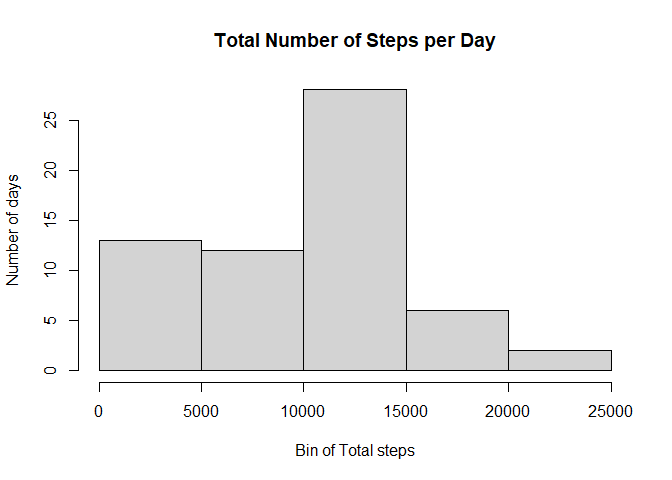
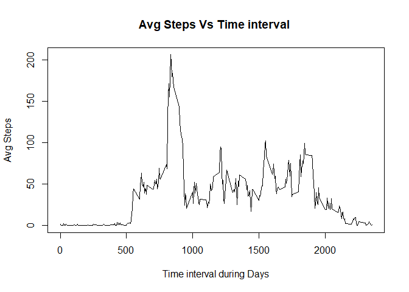
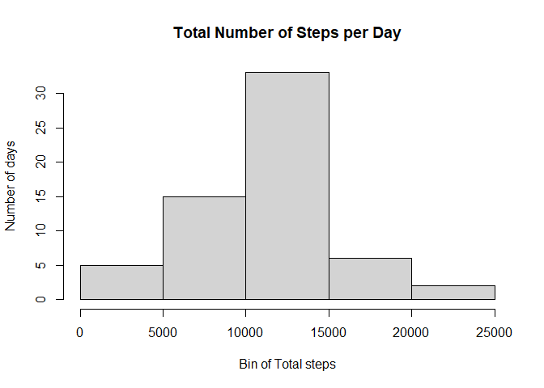
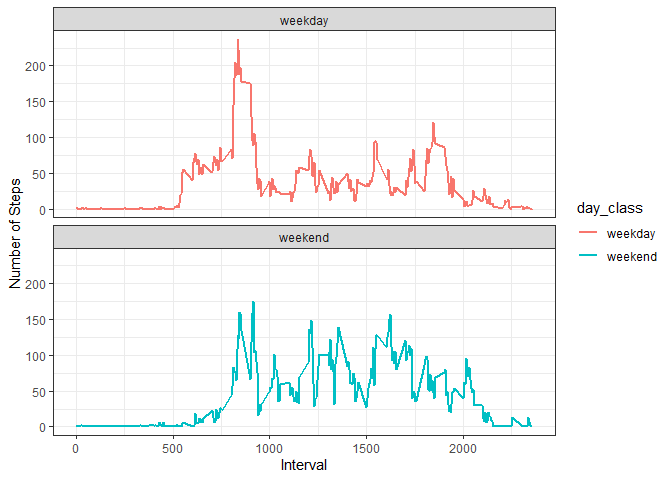

## Loading and preprocessing the data


```r
library(tidyverse)
```

```
## Warning: package 'tidyverse' was built under R version 4.0.5
```

```
## -- Attaching packages --------------------------------------- tidyverse 1.3.1 --
```

```
## v ggplot2 3.3.5     v purrr   0.3.4
## v tibble  3.1.6     v dplyr   1.0.7
## v tidyr   1.1.4     v stringr 1.4.0
## v readr   2.1.1     v forcats 0.5.1
```

```
## Warning: package 'ggplot2' was built under R version 4.0.5
```

```
## Warning: package 'tibble' was built under R version 4.0.5
```

```
## Warning: package 'tidyr' was built under R version 4.0.5
```

```
## Warning: package 'readr' was built under R version 4.0.5
```

```
## Warning: package 'dplyr' was built under R version 4.0.5
```

```
## -- Conflicts ------------------------------------------ tidyverse_conflicts() --
## x dplyr::filter() masks stats::filter()
## x dplyr::lag()    masks stats::lag()
```

```r
list.files()
```

```
## [1] "activity.zip"                  "doc"                          
## [3] "instructions_fig"              "PA1_analysis.R"               
## [5] "PA1_template.Rmd"              "README.md"                    
## [7] "RepData_PeerAssessment1.Rproj"
```

```r
# CHECKING FILES INSIDE "activity.zip"  FOLDER-
unzip("activity.zip", list = TRUE)
```

```
##           Name Length                Date
## 1 activity.csv 350829 2014-02-11 10:08:00
```

```r
# READING DATA - 
dta <- read_csv( unz("activity.zip",  "activity.csv") )
```

```
## Rows: 17568 Columns: 3
```

```
## -- Column specification --------------------------------------------------------
## Delimiter: ","
## dbl  (2): steps, interval
## date (1): date
```

```
## 
## i Use `spec()` to retrieve the full column specification for this data.
## i Specify the column types or set `show_col_types = FALSE` to quiet this message.
```

```r
dta$date <- as.Date(dta$date, "%Y-%m-%d")
```


## What is mean total number of steps taken per day?


```r
# TOTAL NUMBER OF STEPS TAKEN PER DAY-

tot_steps <-
  dta %>% group_by(date) %>%
  summarise(tot_step_perday = sum(steps, na.rm = TRUE))

hist(x = tot_steps$tot_step_perday, 
     xlab = "Bin of Total steps",
     ylab = "Number of days",
     main = "Total Number of Steps per Day")
```

<!-- -->

# MEAN AND MEDIAN - 


```r
mean(tot_steps$tot_step_perday, na.rm = TRUE)
```

```
## [1] 9354.23
```

```r
median(tot_steps$tot_step_perday, na.rm = TRUE)
```

```
## [1] 10395
```


# Calculate and report the total number of missing values in the dataset


```r
sum(is.na(dta$steps))
```

```
## [1] 2304
```

```r
sum(is.na(dta$date))
```

```
## [1] 0
```

```r
sum(is.na(dta$interval))
```

```
## [1] 0
```


## What is the average daily activity pattern?


```r
# 5 min interval and avg steps across all days

min5_avgsteps <- dta %>% group_by(interval) %>% 
  summarise(avg_stps = mean(steps, na.rm = TRUE) )


# Which 5-minute interval, on average across all the days in the dataset, 
# contains the maximum number of steps?

min5_avgsteps$interval[ min5_avgsteps$avg_stps == max(min5_avgsteps$avg_stps)  ]
```

```
## [1] 835
```

```r
plot( x = min5_avgsteps$interval, 
      y = min5_avgsteps$avg_stps, type = "l",
      xlab = "Time interval during Days",
      ylab = "Avg Steps",
      main = "Avg Steps Vs Time interval ")
```

<!-- -->


## Imputing missing values


```r
# FINDING THE DAY OF WEEK-

dta$day <- weekdays(dta$date)


# IMPUTING MISSING VALUES WITH THE AVERAGE OF STEPS DURING THAT INTERVAL 
# ON OTHER DAYS OF THE SAME WEEKDAY -  


imp_dta <- dta %>%
  group_by(interval, day) %>%
  mutate(steps =  case_when(is.na(steps) ~
                              round(mean(steps, na.rm = TRUE)),
                            TRUE ~ steps)) %>%
  ungroup()
```

## Are there differences in activity patterns between weekdays and weekends?


```r
# TOTAL NUMBER OF STEPS TAKEN PER DAY with IMPUTED DATA-

imp_tot_steps <-
  imp_dta %>% group_by(date) %>%
  summarise(tot_step_perday = sum(steps))

hist(x = imp_tot_steps$tot_step_perday, 
     xlab = "Bin of Total steps",
     ylab = "Number of days",
     main = "Total Number of Steps per Day")
```

<!-- -->

```r
# MEAN AND MEDIAN - 
mean(imp_tot_steps$tot_step_perday, na.rm = TRUE)
```

```
## [1] 10821.1
```

```r
median(imp_tot_steps$tot_step_perday, na.rm = TRUE)
```

```
## [1] 11015
```

```r
# Create a new factor variable in the data set with two levels - 
# "weekday" and "weekend"


imp_dta <- imp_dta %>%
  mutate(day_class = case_when(day %in% c("Saturday", "Sunday") ~ "weekend",
                               TRUE ~ "weekday"))


avg_int.day_stp <- imp_dta %>% 
  group_by(interval, day_class) %>% 
  summarise(avg_stps = mean(steps) )
```

```
## `summarise()` has grouped output by 'interval'. You can override using the `.groups` argument.
```

```r
avg_int.day_stp %>% 
  ggplot( aes(x = interval, y = avg_stps, color = day_class) ) + 
  facet_wrap( "day_class" , ncol = 1) +
  geom_line(size = 1) +
  theme_bw() +
  xlab("Interval") +
  ylab("Number of Steps") 
```

<!-- -->


